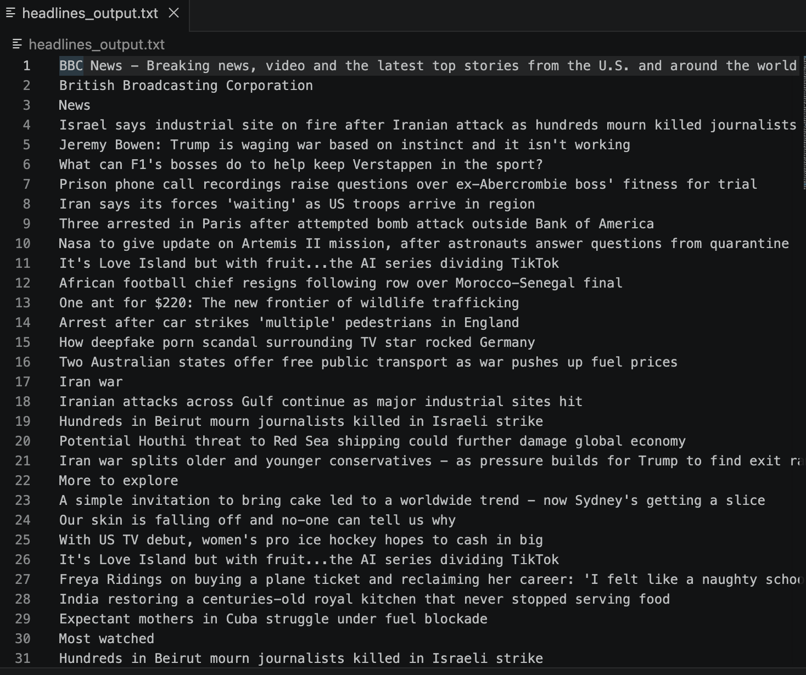

# Python News Headline Scraper

A Python-based command-line tool that scrapes news headlines from a given website URL and saves them to a text file.

This project demonstrates web scraping, HTTP requests, HTML parsing, and file handling using Python.

## Features

- Scrapes headlines from any provided news website URL
- Extracts text from `<h2>` and `<title>` HTML tags
- Saves results to a text file
- Handles network and runtime errors gracefully

## Technologies Used

- Python 3
- Requests
- BeautifulSoup (bs4)

## Project Structure

```
python-news-headline-scraper
│
├── scraper.py
├── headlines_output.txt
├── README.md
├── .gitignore
├── requirements.txt
└── screenshots/
    |__ example_run.png
    |__ example_results.png
```

## Installation

1. Clone the repository:

```
git clone https://github.com/nickdrozario/python-news-headline-scraper.git
```

2. Navigate to the project folder:

```
cd python-news-headline-scraper
```

3. Install dependencies:

```
pip install -r requirements.txt
```

## How to Run

```
python scraper.py
```

Enter a news website URL when prompted.

## Example Usage

### Input

```
Enter the news website URL: https://example.com
```

### Output

Headlines will be saved to:

```
headlines_output.txt
```

## Screenshot

### Example Run


### Example Results


## Concepts Demonstrated

- Web scraping with BeautifulSoup
- HTTP requests using Requests
- File handling in Python
- Error handling with try/except
- Parsing HTML content

## Future Improvements

- Filter duplicate headlines
- Support more HTML tags (e.g., `<h1>`, `<h3>`)
- Export to CSV or JSON
- Build a web interface using Flask
- Add unit tests

## Author

Nicholas D' Rozario
